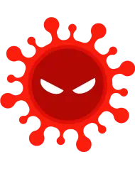

# Whoami
With 15 year of IT experience. Passed since Support Analyst to Senior Consultant/ Pre Sales. 
The most experience that I have is like consultant, where my activities was:
* Design, Architecting and Implementation Software Solutions (EPP, EDR, Antispam, WAF, DLP) from vendors.
* Design, Architecting and Implementation Network Security Solutions (Firewall, Proxy, Wireless IPS) from vendors.
* Archtecting Security layers for Cloud Environments(AWS)
* 

## Certifications

## Projects
### Pratical Projects for SOC services
* **Live SOC Monitoring (LetsDefend)**: Monitored real-time security alerts, performed triage, and investigated
incidents in a simulated SOC environment.
### Learning Paths

### Skills badges
